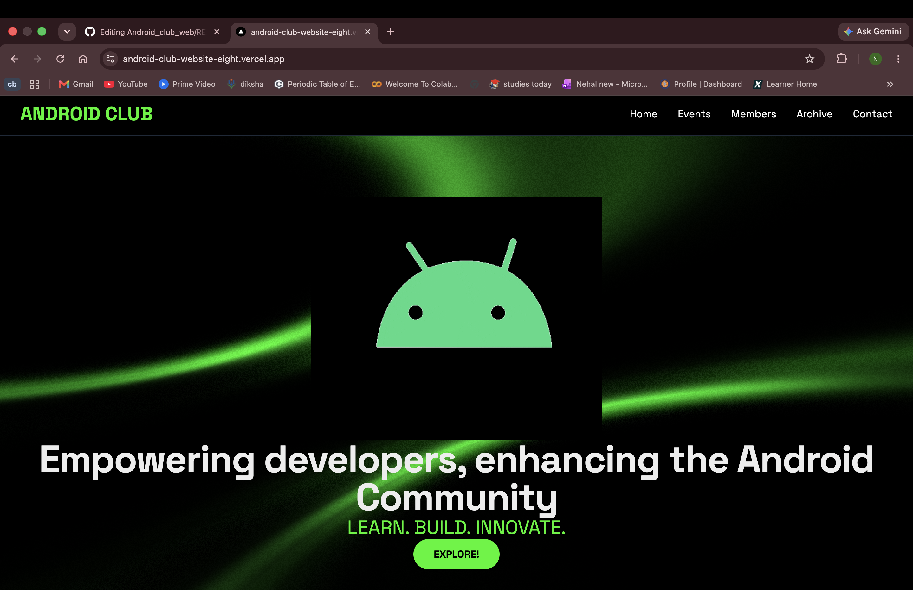
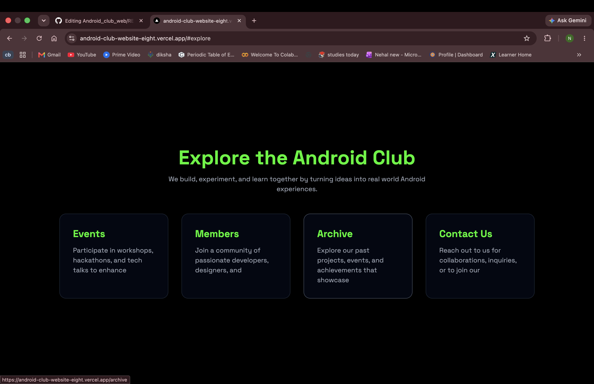
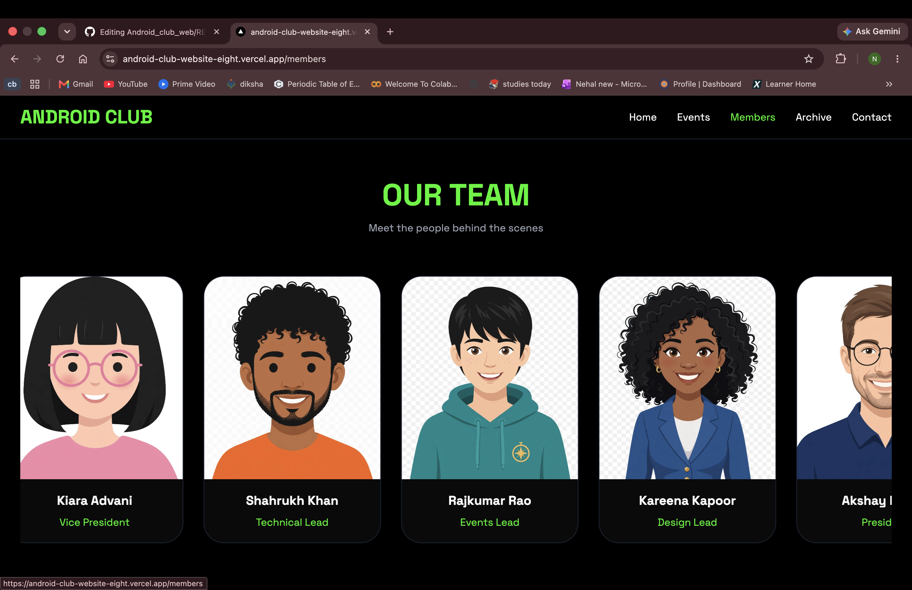
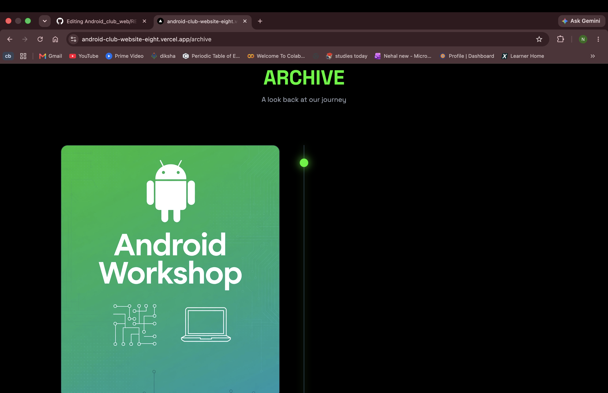
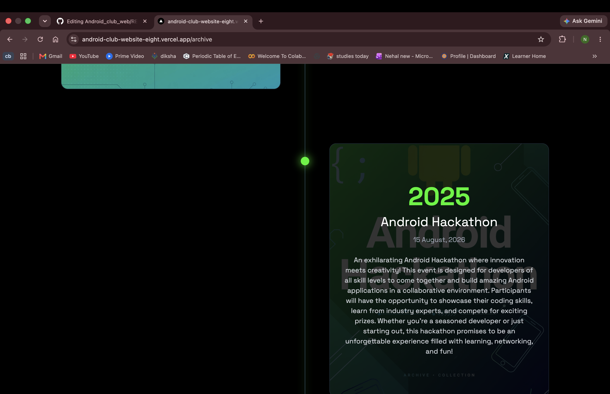
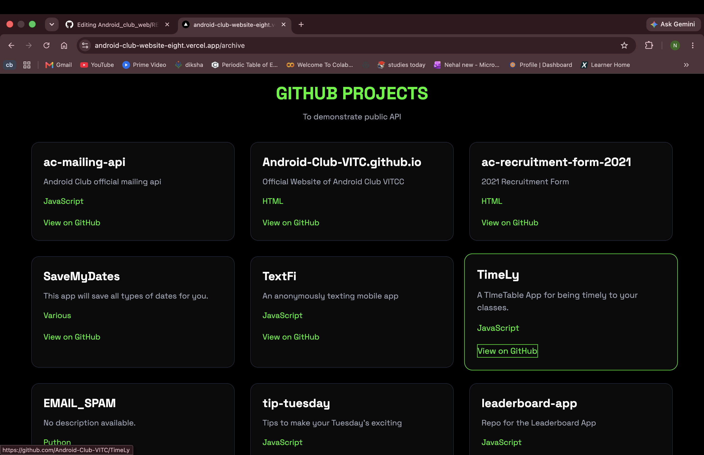
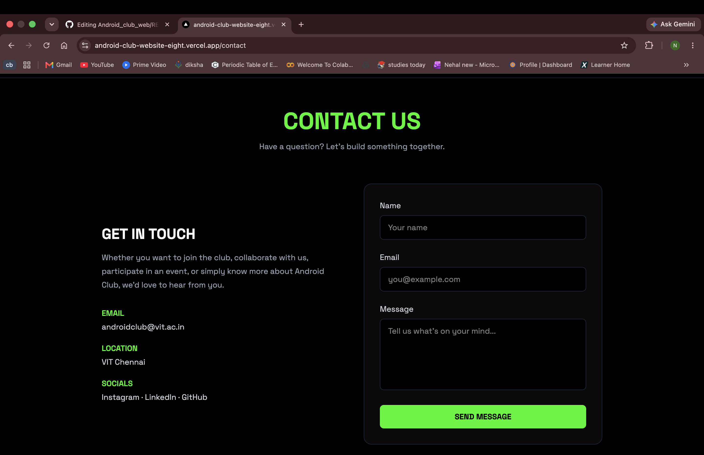
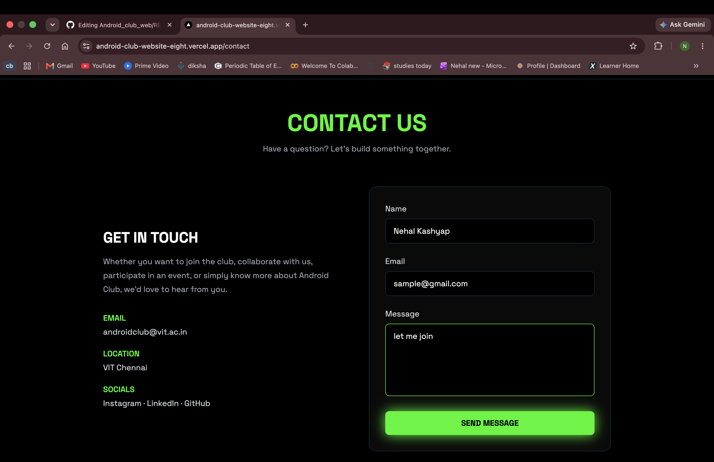

A modern, interactive sample website built for the Android Club to showcase its activities, events, members, archived work and contact the team for collaborate on projects or pitch ideas.

The website provides a centralized platform where students can explore the club, view upcoming events, learn about the team, and access previous activities and projects.

##  Live Demo

**Live Website:**
[https://android-club-website-eight.vercel.app/]

---

##  Screenshots

### Home Page




### Events Page


### Members Page




### Archive Page





### Contact Page




> Screenshots are stored in the `screenshots` folder of this repository.

---

## 🎥 Demo Video

A complete demonstration of the website is available below:

**Demo video**


https://github.com/user-attachments/assets/68797412-b801-4cac-acaf-1e544f5735fa

**mongoDB demo video**

https://github.com/user-attachments/assets/09d237ac-231e-4c01-94ba-ec9ed23dae1f


The videos demonstrate:

* Home page and navigation
* Events section
* Event details
* Members carousel
* Archive section
* Contact page
* Backend/API functionality
* MongoDB data integration
* Responsive and interactive UI

---

##  Features

* Modern Android Club themed interface
* Responsive design
* Persistent navigation across pages
* Interactive event cards
* Event details and registration links
* Animated members carousel
* Members data retrieved from MongoDB
* Backend API integration using Next.js API routes
* MongoDB database integration
* Mongoose for database interaction
* Archive/timeline section
* Contact page
* Interactive animations and hover effects
* Deployed using Vercel

---

## 🛠️ Tech Stack

### Frontend

* **Next.js**
* **React**
* **TypeScript**
* **Tailwind CSS**
* **HTML5**
* **CSS3**

### Backend

* **Next.js API Routes**
* **Node.js**
* **MongoDB**
* **Mongoose**

### Deployment

* **Vercel**
* **MongoDB Atlas**

### Development Tools

* **Git**
* **GitHub**
* **VS Code**

---

##  Project Structure

```text
android-club/
│
├── app/
│   ├── api/
│   │   └── members/
│   │       └── route.ts
│   │
│   ├── archive/
│   │   └── page.tsx
│   │
│   ├── contact/
│   │   └── page.tsx
│   │
│   ├── events/
│   │   └── page.tsx
│   │
│   ├── members/
│   │   └── page.tsx
│   │
│   ├── globals.css
│   ├── layout.tsx
│   └── page.tsx
│
├── components/
│   └── ColorBends.tsx
│
├── lib/
│   └── mongodb.ts
│
├── public/
│   ├── events/
│   ├── members/
│   └── ...
│
├── package.json
├── tsconfig.json
├── next.config.ts
└── README.md
```

---

##  Implementation

### 1. Next.js Application

The website is built using Next.js with the App Router.

Different sections of the website are implemented as separate routes:

```text
/
├── /events
├── /members
├── /archive
└── /contact
```

This allows each section to have its own page while maintaining a consistent navigation layout.

---

### 2. React Components

React components are used to create reusable and interactive elements throughout the website.

For example, the website contains reusable components for visual effects and UI elements.

Interactive functionality is implemented using React features such as state management and event handling.

---

### 3. TypeScript

TypeScript is used throughout the project to provide type safety and improve code reliability.

It is used for:

* Component development
* API routes
* Database-related code
* Data structures
* Application logic

---

### 4. Tailwind CSS

Tailwind CSS is used for styling the website.

It provides utility classes for:

* Layout
* Spacing
* Typography
* Responsive design
* Hover effects
* Animations
* Colors
* Positioning

The website uses a dark theme with neon green elements inspired by Android's visual identity.

---

### 5. MongoDB Integration

MongoDB is used as the database for storing dynamic club information.

The project uses **MongoDB Atlas** as the cloud database.

The database stores member information such as:

```text
name
position
image
```

This allows member information to be retrieved dynamically instead of hardcoding all the data directly into the page.

---

### 6. Mongoose

Mongoose is used to interact with MongoDB from the application.

A MongoDB connection is established through:

```text
lib/mongodb.ts
```

The connection is reused by the application to communicate with the database.

---

### 7. Backend API

A backend API endpoint is implemented using a Next.js API route:

```text
/api/members
```

The API retrieves member information from MongoDB and returns it to the frontend.

The general flow is:

```text
Frontend
    ↓
Next.js API
    ↓
Mongoose
    ↓
MongoDB Atlas
    ↓
Member Data
    ↓
Frontend
```

This separates the frontend presentation from the database layer.

---


## 📖 Usage

After starting the application, users can:

### Home

Explore the Android Club and navigate to different sections of the website.

### Events

View upcoming and previous club events and interact with event cards to see additional information.

### Members

View the Android Club team through the interactive members carousel.

Member information is retrieved through the backend API and MongoDB.

### Archive

Explore previous club activities and achievements through the timeline-style archive.

### Contact

Access the club's contact information and communication options.

---

##  Deployment

The application is deployed using **Vercel**.

The production deployment connects the Next.js application with MongoDB Atlas through environment variables configured in the deployment environment.

---


##  Learning Outcomes

Through this project, the following technologies and concepts were implemented:

* React
* Next.js
* Next.js App Router
* TypeScript
* Tailwind CSS
* Multi-page website architecture
* API routes
* Backend integration
* MongoDB
* MongoDB Atlas
* Mongoose
* Git and GitHub
* Vercel deployment
* Environment variables
* Responsive web design
* Component-based development

---

##  Author

**Nehal Kashyap**
25BAI1636

CSE (AI/ML)

VIT Chennai

---

